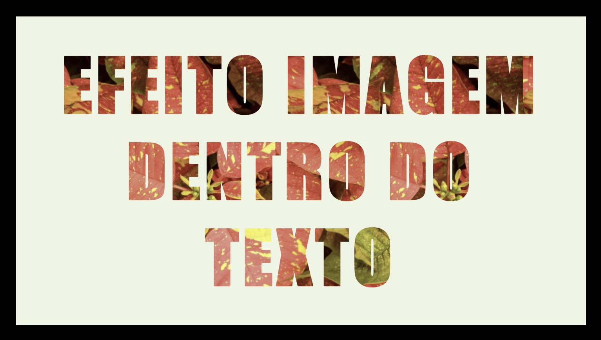
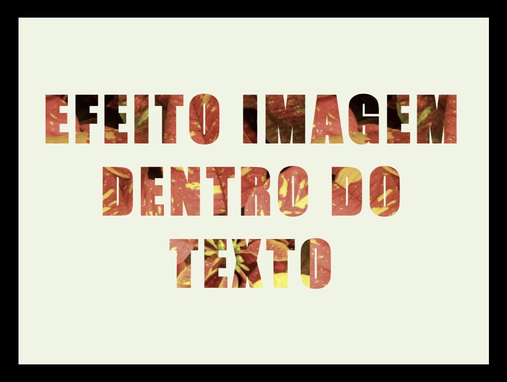

# Self-learning_Proj_001-letras-com-fundo-img

# Projeto Letras com efeito de fundo de Imagens:

- HTML e CSS

## Imagens do Projeto:
<!-- style="display: flex; justify-content: center; text-align: center; gap: 20px;" -->

   <!--  -->
   
   
   <!--  -->
   
   
   <!--  -->
   
   
   <!--  -->
   
   
   <!--  -->
   

   <!--  -->
   

   <!--  -->
   

   <!--  -->
   

## Links de Referência:

https://youtu.be/YZHhXwIQksI?si=oMp6nomTBSqXmnwo
Criando Efeito Imagem Dentro do Texto | HTML e CSS

https://youtu.be/tXROaQBzMTk?si=IFC-F906Z2V4OKtN
Como Centralizar uma DIV ou Qualquer coisa no CSS

Site Imagens: https://pixabay.com/pt/images/search/fundo%20floral/

# Objetivos Self-learning:

- Projeto para aprender a usar imagens em arquivo para decorar textos.
- Combinado estudo para testar os recursos de centralização css.

# Observações:

Esse projeto já está com opções de uploading de algumas imagens que já estão comentadas no css, logo, caso tenha interesse, poderá ir "descomentando" as imagens para trocar para uma que mais lhe agrade visualmente.

Marcia Moreira
02/12/2022.
